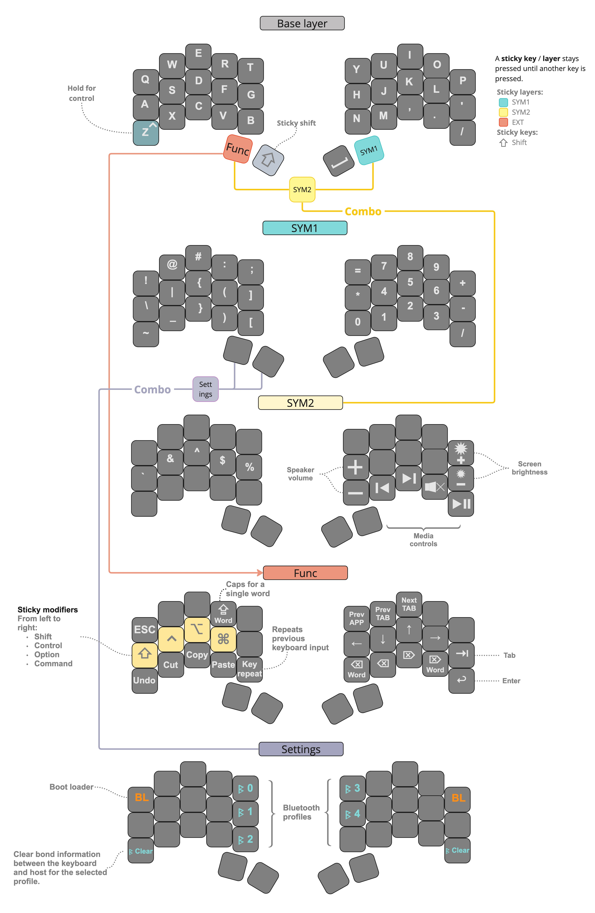

# 34 key keyboard layout

This layout was inspired by [Seniply](https://stevep99.github.io/seniply/) & [duckyb](https://github.com/duckyb/zmk-sweep)

The repository contains the [ZMK](https://zmk.dev/) keymap config for the wireless Ferris Sweep with the Nice!Nano board.

